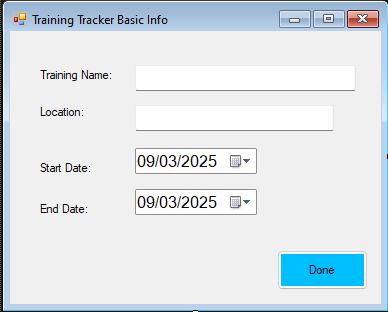
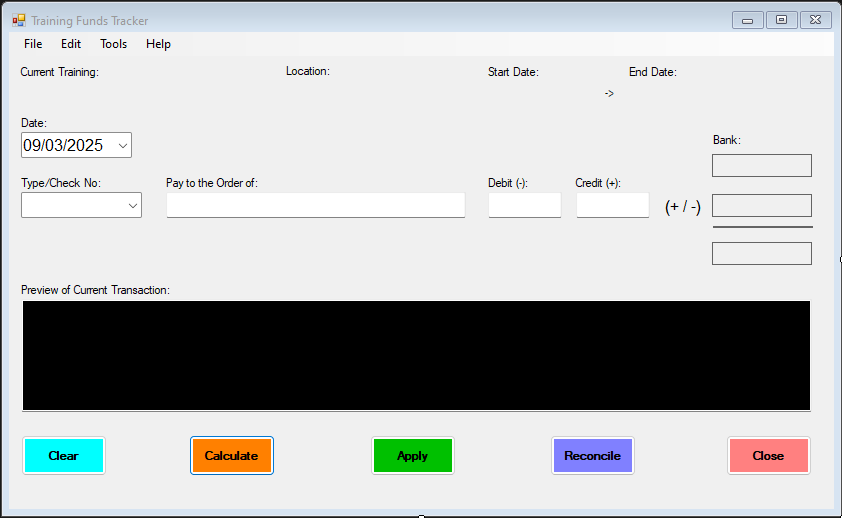

# Training Funds Tracker 2.0

Adds the ability to track a travel advance for training much like a checkbook register.

### ID Form

Allows you to enter a training location with start and end date

### Main Form

Use the form to enter in transactions.  It gives a preview of the entry and submits it to the bank file.
The bank file is a simple text file that looks like a check register. The main form has the ability to reconcile 
the current training and start a new one.  Each training will be reconciled into it's own folder for readability 
and simplicity.